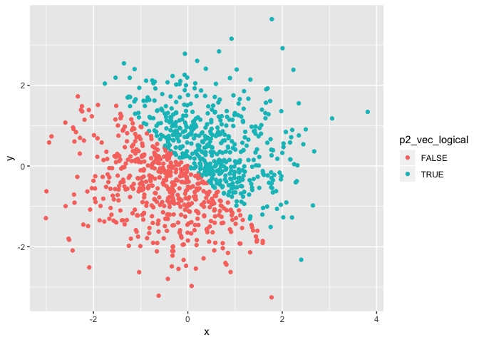
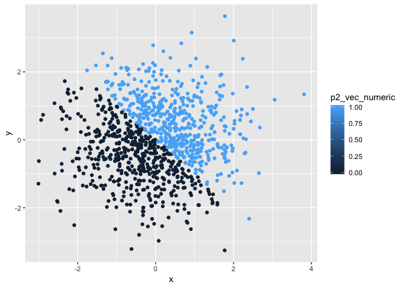

p8105\_hw1\_bs3142
================
Bingyu Sun
9/17/2018

Problem 1
=========

(a) Create data frame
---------------------

Load package tidyverse

``` r
library(tidyverse)
```

    ## ── Attaching packages ──────────────────────────── tidyverse 1.2.1 ──

    ## ✔ ggplot2 3.0.0     ✔ purrr   0.2.5
    ## ✔ tibble  1.4.2     ✔ dplyr   0.7.6
    ## ✔ tidyr   0.8.1     ✔ stringr 1.3.1
    ## ✔ readr   1.1.1     ✔ forcats 0.3.0

    ## ── Conflicts ─────────────────────────────── tidyverse_conflicts() ──
    ## ✖ dplyr::filter() masks stats::filter()
    ## ✖ dplyr::lag()    masks stats::lag()

-   Create a data frame comprised of
    -   A random sample of size 10 from a uniform\[0, 5\] distribution
    -   A logical vector indicating whether elements of the sample are greater than 2
    -   A (length-10) character vector
    -   A (length-10) factor vector

``` r
set.seed(1)

q1_df = tibble(q1_random_sample = runif(n = 10, min = 0, max = 5),
               q1_vec_char = c("This", "is", "trying", "to", "answer", "question", "one", "of", "homework", "one"),
               q1_vec_logical = c(q1_random_sample > 2),
               q1_vec_factor = factor(c("blue", "green", "blue", "green", "green", "blue", "blue", "green", "blue", "green"))
)
```

### (b) Mean of each variable in my dataframe

Try to take the mean of each variable in your dataframe. What works and what doesn’t? Why?

``` r
mean(q1_df$q1_random_sample)
```

    ## [1] 2.757569

``` r
mean(q1_df$q1_vec_char)
```

    ## Warning in mean.default(q1_df$q1_vec_char): argument is not numeric or
    ## logical: returning NA

    ## [1] NA

``` r
mean(q1_df$q1_vec_logical)
```

    ## [1] 0.6

``` r
mean(q1_df$q1_vec_factor)
```

    ## Warning in mean.default(q1_df$q1_vec_factor): argument is not numeric or
    ## logical: returning NA

    ## [1] NA

Means of random\_sample and logical vector work, whereas means for character vector and factor vector do not work. This is because means can only be calculated from numeric values.

#### (c) Convert character, logical, and factor vectors to numeric numbers

-   Write a code chunk that applies the as.numeric function to the logical, character, and factor variables (show this chunk but not the output).

``` r
as.numeric(q1_df$q1_vec_char)
as.numeric(q1_df$q1_vec_logical)
as.numeric(q1_df$q1_vec_factor)
```

-   In a second code chunk, convert your character variable from character to factor to numeric; similarly, convert your factor variable from factor to character to numeric. What happens?

``` r
q1_vec_char2 <- as.factor(q1_df$q1_vec_char)
as.numeric(q1_vec_char2)
```

    ##  [1] 7 3 9 8 1 6 5 4 2 5

``` r
q1_vec_fac2 <- as.character(q1_df$q1_vec_factor)
as.numeric(q1_vec_fac2)
```

    ## Warning: NAs introduced by coercion

    ##  [1] NA NA NA NA NA NA NA NA NA NA

When character variable is converted to factor variable first, it can be converted to numeric factor. However, when a factor is converted to character, it can no longer be converted to numeric factor. Therefore, only factor vector can be converted to numeric values.

Problem 2
=========

This problem focuses on plotting and the use of inline R code.

(a) Create data frame
---------------------

-   Create a data frame comprised of:
    -   x: a random sample of size 1000 from a standard Normal distribution
    -   y: a random sample of size 1000 from a standard Normal distribution
    -   A logical vector indicating whether the x + y &gt; 0
    -   A numeric vector created by coercing the above logical vector
    -   A factor vector created by coercing the above logical vector

``` r
p2_df = tibble(x = rnorm(n = 1000, mean = 0, sd = 1),
               y = rnorm(n = 1000, mean = 0, sd = 1),
               p2_vec_logical = c(x + y > 0),
               p2_vec_numeric = as.numeric(p2_vec_logical),
               p2_vec_factor = as.factor(p2_vec_logical),
)
```

### (b) Summary using inline R code

Write a short description of your vector using inline R code, including: \* the size of the dataset \* the mean and median of x \* the proportion of cases for which the logical vector is TRUE

The size of dataset is , the mean of x is -0.0106382, and the median of x is -0.031318, the proportion of cases for which the logical vector is TRUE is \`r pro

Scatterplot
-----------

Make a scatterplot of y vs x.

``` r
p2_xy_sp1 <- ggplot(p2_df, aes(x = x, y = y, color = p2_vec_logical)) + geom_point()

p2_xy_sp1
```

 Blue dots represent x + y &gt; 0, and red dots represent x + y &lt; 0.

``` r
p2_xy_sp2 <- ggplot(p2_df, aes(x =x, y = y, color = p2_vec_numeric)) + geom_point()

p2_xy_sp2
```



``` r
p2_xy_sp3 <- ggplot(p2_df, aes(x =x, y = y, color = p2_vec_factor)) + geom_point()

p2_xy_sp3
```


They all look the same.

Export your first scatterplot to your project directory using ggsave.

``` r
ggsave("p2_xy_sp1.pdf")
```

    ## Saving 7 x 5 in image
