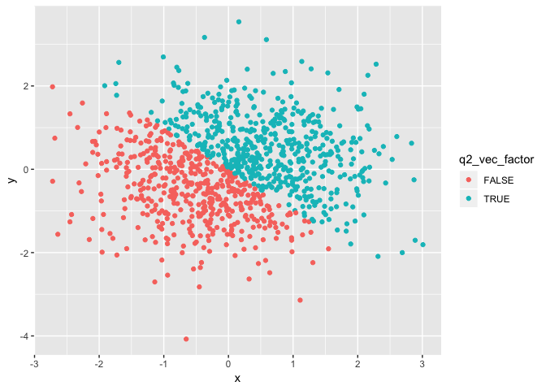
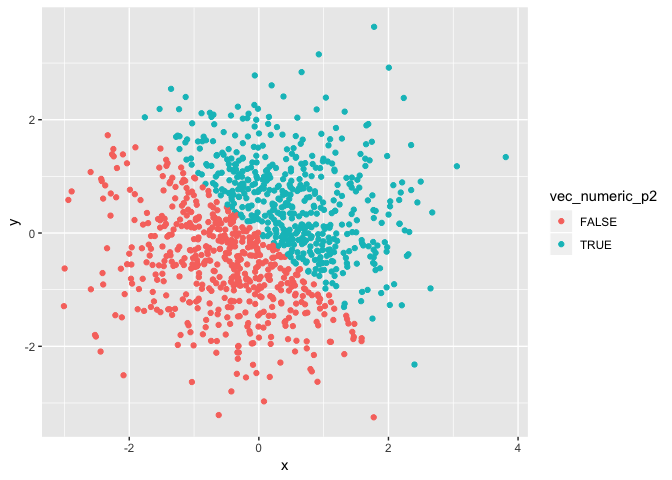
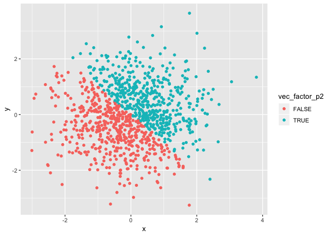

p8105\_hw1\_bs3142
================
Bingyu Sun
9/17/2018

Problem 1
=========

Create data frame
-----------------

``` r
library(tidyverse)
```

    ## ── Attaching packages ──────────────────────────── tidyverse 1.2.1 ──

    ## ✔ ggplot2 3.0.0     ✔ purrr   0.2.5
    ## ✔ tibble  1.4.2     ✔ dplyr   0.7.6
    ## ✔ tidyr   0.8.1     ✔ stringr 1.3.1
    ## ✔ readr   1.1.1     ✔ forcats 0.3.0

    ## ── Conflicts ─────────────────────────────── tidyverse_conflicts() ──
    ## ✖ dplyr::filter() masks stats::filter()
    ## ✖ dplyr::lag()    masks stats::lag()

``` r
set.seed(1)

p1_df = tibble(
  random_sample = runif(n = 10, min = 0, max = 5),
  vec_char = c("This", "is", "trying", "to", "answer", "question", "one", "of", "homework", "one"),
  vec_logical = c(random_sample > 2),
  vec_factor = factor(c("blue", "green", "blue", "green", "green", "blue", "blue", "green", "blue", "green"))
)
```

### Means of each variable in my dataframe.

``` r
mean(p1_df$random_sample)
```

    ## [1] 2.757569

``` r
mean(p1_df$vec_char)
```

    ## Warning in mean.default(p1_df$vec_char): argument is not numeric or
    ## logical: returning NA

    ## [1] NA

``` r
mean(p1_df$vec_logical)
```

    ## [1] 0.6

``` r
mean(p1_df$vec_factor)
```

    ## Warning in mean.default(p1_df$vec_factor): argument is not numeric or
    ## logical: returning NA

    ## [1] NA

Means of random\_sample and vec\_logical work, whearas means for vec\_char and vec\_factor do not work. This is because means can only be calculated from numeric values.

#### Convert character, logical, and factor vectors to numeric numbers

Write a code chunk that applies the as.numeric function to the logical, character, and factor variables (show this chunk but not the output).

``` r
as.numeric(p1_df$vec_char)
```

    ## Warning: NAs introduced by coercion

    ##  [1] NA NA NA NA NA NA NA NA NA NA

``` r
as.numeric(p1_df$vec_logical)
```

    ##  [1] 0 0 1 1 0 1 1 1 1 0

``` r
as.numeric(p1_df$vec_factor)
```

    ##  [1] 1 2 1 2 2 1 1 2 1 2

In a second code chunk, convert your character variable from character to factor to numeric; similarly, convert your factor variable from factor to character to numeric. What happens?

``` r
vec_char2 <- as.factor(p1_df$vec_char)
as.numeric(vec_char2)
```

    ##  [1] 7 3 9 8 1 6 5 4 2 5

``` r
vec_fac2 <- as.character(p1_df$vec_factor)
as.numeric(vec_fac2)
```

    ## Warning: NAs introduced by coercion

    ##  [1] NA NA NA NA NA NA NA NA NA NA

Problem 2
=========

This problem focuses on plotting and the use of inline R code.

Create data frame
-----------------

Create a data frame comprised of: x: a random sample of size 1000 from a standard Normal distribution y: a random sample of size 1000 from a standard Normal distribution A logical vector indicating whether the x + y &gt; 0 A numeric vector created by coercing the above logical vector A factor vector created by coercing the above logical vector

``` r
p2_df = tibble(
  x = rnorm(n = 1000, mean = 0, sd = 1),
  y = rnorm(n = 1000, mean = 0, sd = 1),
  vec_logical_p2 = c(x + y > 0),
  vec_numeric_p2 = c(vec_logical_p2),
  vec_factor_p2 = c(vec_logical_p2)
)

p2_df
```

    ## # A tibble: 1,000 x 5
    ##         x      y vec_logical_p2 vec_numeric_p2 vec_factor_p2
    ##     <dbl>  <dbl> <lgl>          <lgl>          <lgl>        
    ##  1 -0.820 -1.66  FALSE          FALSE          FALSE        
    ##  2  0.487  0.811 TRUE           TRUE           TRUE         
    ##  3  0.738 -1.91  FALSE          FALSE          FALSE        
    ##  4  0.576 -1.25  FALSE          FALSE          FALSE        
    ##  5 -0.305  0.998 TRUE           TRUE           TRUE         
    ##  6  1.51  -0.541 TRUE           TRUE           TRUE         
    ##  7  0.390 -0.216 TRUE           TRUE           TRUE         
    ##  8 -0.621 -1.62  FALSE          FALSE          FALSE        
    ##  9 -2.21  -1.45  FALSE          FALSE          FALSE        
    ## 10  1.12   0.351 TRUE           TRUE           TRUE         
    ## # ... with 990 more rows

Write a short description of your vector using inline R code, including: \* the size of the dataset \* the mean and median of x \* the proportion of cases for which the logical vector is TRUE

The size of dataset is , the mean of x is -0.0106382, and the median of x is -0.031318, the proportion of cases for which the logical vector is TRUE is \`r pro

Scatterplot
-----------

Make a scatterplot of y vs x.

``` r
p2_xy_sp1 <- ggplot(p2_df, aes(x = x, y = y, color = vec_logical_p2)) + geom_point()

p2_xy_sp1
```

 Blue dots represent x + y &gt; 0, and red dots represent x + y &lt; 0.

``` r
p2_xy_sp2 <- ggplot(p2_df, aes(x =x, y = y, color = vec_numeric_p2)) + geom_point()

p2_xy_sp2
```



``` r
p2_xy_sp3 <- ggplot(p2_df, aes(x =x, y = y, color = vec_factor_p2)) + geom_point()

p2_xy_sp3
```



They all look the same.

Export your first scatterplot to your project directory using ggsave.

``` r
ggsave("p2_xy_sp1.pdf")
```

    ## Saving 7 x 5 in image
