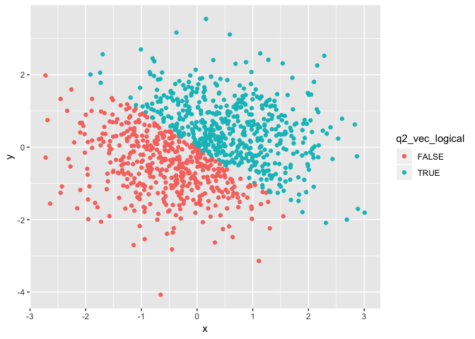

p8105\_hw1\_bs3142
================
Bingyu Sun
9/17/2018

Problem 1
=========

(a) Create data frame
---------------------

Load package tidyverse

``` r
library(tidyverse)
```

    ## ── Attaching packages ──────────────────────────── tidyverse 1.2.1 ──

    ## ✔ ggplot2 3.0.0     ✔ purrr   0.2.5
    ## ✔ tibble  1.4.2     ✔ dplyr   0.7.6
    ## ✔ tidyr   0.8.1     ✔ stringr 1.3.1
    ## ✔ readr   1.1.1     ✔ forcats 0.3.0

    ## ── Conflicts ─────────────────────────────── tidyverse_conflicts() ──
    ## ✖ dplyr::filter() masks stats::filter()
    ## ✖ dplyr::lag()    masks stats::lag()

-   Create a data frame comprised of
    -   A random sample of size 10 from a uniform\[0, 5\] distribution
    -   A logical vector indicating whether elements of the sample are greater than 2
    -   A (length-10) character vector
    -   A (length-10) factor vector

``` r
set.seed(1)

q1_df = tibble(q1_random_sample = runif(n = 10, min = 0, max = 5),
               q1_vec_char = c("This", "is", "trying", "to", "answer", "question", "one", "of", "homework", "one"),
               q1_vec_logical = (q1_random_sample > 2),
               q1_vec_factor = factor(c("blue", "green", "blue", "green", "green", "blue", "blue", "green", "blue", "green"))
)
```

(b) Means of variables
----------------------

Means for my random sample, character vector, logical vector, and factor vector are:

``` r
mean(q1_df$q1_random_sample)
```

    ## [1] 2.757569

``` r
mean(q1_df$q1_vec_char)
```

    ## Warning in mean.default(q1_df$q1_vec_char): argument is not numeric or
    ## logical: returning NA

    ## [1] NA

``` r
mean(q1_df$q1_vec_logical)
```

    ## [1] 0.6

``` r
mean(q1_df$q1_vec_factor)
```

    ## Warning in mean.default(q1_df$q1_vec_factor): argument is not numeric or
    ## logical: returning NA

    ## [1] NA

Reasoning: Using mean() function, mean of my random sample and mean of logical vector can be computed. However, it does not apply to charactor or factor vector. By definition, mean only applies to numeric variables. Since my randomly generated sample is numeric, mean() function works. For logical vector, the condtion "true" or "false" is represented as 1s or 0s respectively, the mean is calculable.

(c) Conversion
--------------

Using as.numeric function to convert the logical, character, and factor variables to numeric numbers (code is included but not the output).

``` r
as.numeric(q1_df$q1_vec_char)
as.numeric(q1_df$q1_vec_logical)
as.numeric(q1_df$q1_vec_factor)
```

-   as.numeric() function can covert logical and factor vectors to numbers, except character vector
-   Logical vector is represented as 1s and 0s
-   Factor vector is represented as levels which in turn converted to numbers

More conversions

``` r
as.factor(q1_df$q1_vec_char)
```

    ##  [1] This     is       trying   to       answer   question one     
    ##  [8] of       homework one     
    ## Levels: answer homework is of one question This to trying

``` r
as.numeric(as.factor(q1_df$q1_vec_char))
```

    ##  [1] 7 3 9 8 1 6 5 4 2 5

``` r
as.character(q1_df$q1_vec_factor)
```

    ##  [1] "blue"  "green" "blue"  "green" "green" "blue"  "blue"  "green"
    ##  [9] "blue"  "green"

``` r
as.numeric(as.character(q1_df$q1_vec_factor))
```

    ## Warning: NAs introduced by coercion

    ##  [1] NA NA NA NA NA NA NA NA NA NA

-   Observations:
    -   Characters are converted to factors by assigning levels to each factor
    -   Numbers are assigned to factors corresponding to factor variables' level
    -   Similarly, factors can be converted to characters
    -   Since characters have no order, it is unable to assign numerics to characters
    -   In summary, it is convertable between character and factor vectors, but only factor vector can be converted to numeric values.

Problem 2
=========

This problem focuses on plotting and the use of inline R code.

(a) Create data frame
---------------------

-   Create a data frame comprised of:
    -   x: a random sample of size 1000 from a standard Normal distribution
    -   y: a random sample of size 1000 from a standard Normal distribution
    -   A logical vector indicating whether the x + y &gt; 0
    -   A numeric vector created by coercing the above logical vector
    -   A factor vector created by coercing the above logical vector

``` r
set.seed(2)

q2_df = tibble(x = rnorm(n = 1000, mean = 0, sd = 1),
               y = rnorm(n = 1000, mean = 0, sd = 1),
               q2_vec_logical = c(x + y > 0),
               q2_vec_numeric = as.numeric(q2_vec_logical),
               q2_vec_factor = as.factor(q2_vec_logical),
)
```

### (b) Summary

-   A short description of my vector using inline R code:
    -   the **size** of the dataset is 1000 rows by 5 columns
    -   the **mean** and **median** of x are 0.0619987 and 0.0501354 respectively
    -   the **proportion** of cases for which the logical vector is TRUE is 0.53.

Scatterplot
-----------

Scatterplot 1 of y vs x and color by logical vector (x + y &gt; 0)

``` r
ggplot(q2_df, aes(x = x, y = y, color = q2_vec_logical)) + geom_point()
```



-   Since our logical vector is defined as x + y &gt; 0, blue dots and red dots represent x + y &gt; 0 and x + y &lt; 0, respectively. The distribution of blue and red dots is symmetric, indicating normal distribution.

Scatterplot 2 of y vs x, color by numeric vector

``` r
ggplot(q2_df, aes(x =x, y = y, color = q2_vec_numeric)) + geom_point()
```


Scatterplot 3 of y vs x, color by factor vector

``` r
ggplot(q2_df, aes(x =x, y = y, color = q2_vec_factor)) + geom_point()
```


-   Since both the numeric vector and factor vector are coerced from logical vector, we expect the three plots to resemble the same distribution. The resulting plots showed same pattern of distribution.
-   For plot 2, which color by numeric vectors, the color is different from two other plots. The reason is that numerics can be continous, whereas both logical and factor vectors are discrete. Therefore, the color for plot 2 is a gradient where 0 is black and 1 is blue. In this case, the plot illustrates only two colors, consistent with numeric vector being only two values.

Export my first scatterplot to my project directory using ggsave.

``` r
ggsave("q2_xy_sp1.pdf")
```

    ## Saving 7 x 5 in image
